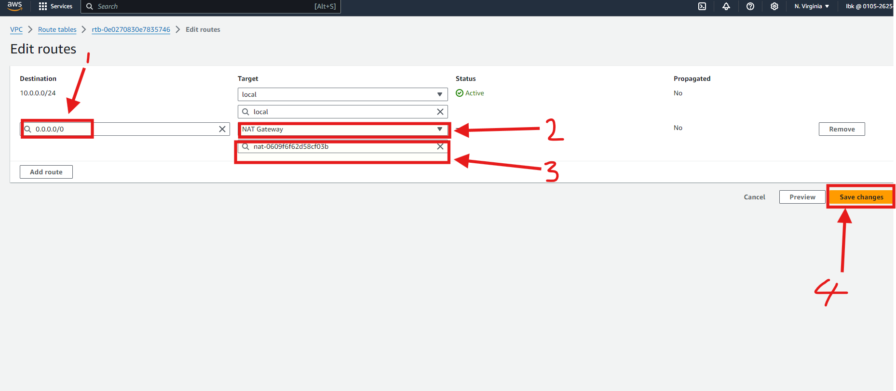

# Project7 - AWS VPC Project

A VPC in AWS enables you to launch resources within a secure, isolated virtual network that you control.

## Step 1 - VPC Creation

- I logged in to my AWS console and searched for VPC as shown below:

- Creation of Internet Gateway

I created internet gateway as shown in the images below:

- Creating subnet naming schemes and subnets

1. Creation of Public Subnet - I followed the steps in the images below:

- I used the steps in the images above to create subnets for:

1. Application Subnets

2. Database Subnets

3. Management Subnets

4. Platform Subnets

** After creating the subnets, this is what I have **

## Route Table Design

I created a custom route table for each subnet group and then set the necessary rules for the subnets. The first one done is for Public route table and it's as shown below:

I added 3 public subnets (prod-web-public a,b,c) as shown below:

- The image below is what I have after creating all 5 route tables and their subnet association:

## NAT (Network Address Translation) Gateway

A NAT gateway allows instances in a private subnet to access external services, while preventing external services from initiating connections to those instances.

To do this, we created a NAT gateway and attached it to all our route tables created earlier as shown below:

We add NAT gateway to our route tables one by one as shown below:

The steps above is repeated for the other route tables (DB, APP and MGT route tables)

** It should be noted that the Public subnet was left out. This is deliberate as as we want to route traffic using internet gateway as shown below:**

## AWS VPC Topology

- To check VPC topology, we follow the steps as shown in the images below:

## Network ACLs

Network access control list (NACL) in a VPC manages inbound and outbound traffic at the subnet level.

Here is a step by step on a Network ACLS:

END OF PROJECT 7